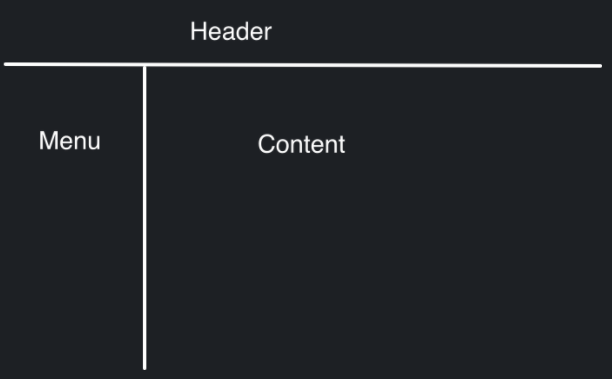
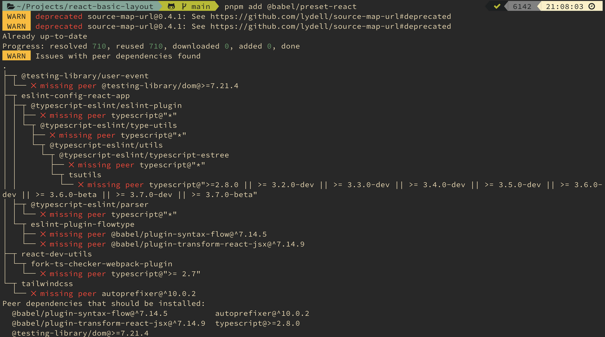

- {{renderer :tocgen}}
- # Description
	- 因為偶爾會寫一些小 project
	  想要有一個可以快速開始的 cra 模板
	  開起來就會是一般網站的 layout
	  像是這樣
	- 
	- 記錄一下開發遇到的問題，既然是自己想做的 side project，技術當然都麻要用最新的。
	  尚青！尚讚！
- # Start with CRA
	- 前端框架使用 react，不為什麼，就是因為我比較熟 react。
	  react 有一個用來快速開發的工具 CRA
	- 在 github create new project 用來當 code base
	- ```
	  $ git clone https://github.com/DaHao/react-basic-layout.git
	  
	  # 確認 node 版本，目前是 v16.13.1
	  $ node --version
	  
	  # start cra
	  $ npx create-react-app react-basic-layout
	  ```
- # 改用 pnpm
	- 聽說 pnpm 比 npm 更好用，現在就來試看看。
	- 有沒有比較強我是不知道，不過結果的可讀性肯定是比較高的。
	- 安裝某個 package 的時候，會明確列出 dependency 的關係
	- {:height 425, :width 746}
	- `$ npm install -g pnpm`
	- `$ pnpm start`
- # eject react
	- 解放 react 真實的力量
	- `$ pnpm eject`
- # 加入 material ui
	- `$ pnpm add @mui/material @emotion/react @emotion/styled
	- 發現要用 emotion 的語法，還要額外作一些設定
	  https://emotion.sh/docs/css-prop
	  https://blog.timtnlee.me/post/development/emotion
	  有兩種方法，加入 babel 設定跟程式裡註明
	- ## 加入 .babelrc
		- ```
		  $ pnpm add @emotion/babel-plugin @babel/preset-react
		  
		  # .babelrc
		  {
		  "presets": [
		    [
		      "@babel/preset-react",
		      { "runtime": "automatic", "importSource": "@emotion/react" }
		    ],
		    "react-app"
		  ],
		  "plugins": ["@emotion/babel-plugin"]
		  }
		  ```
		- 加入之後還是沒辦法像預期的用 css 屬性，也確認版本沒有問題，不知道是哪裡出錯
		- 最後還是要加上 `/** @jsxImportSource @emotion/react */` 才能使用 (react-17 以上用此註明)
		- ```javascript
		  /** @jsxImportSource @emotion/react */
		  import React from 'react';
		  import { css } from '@emotion/react';
		  import Header from './Header';
		  import Navigation from './Navigation';
		  const wrapperCss = css`
		  dispaly: flex;
		  top: 64px;
		  position: relative;
		  height: calc(100% - 64px);
		  width: 100%;
		  flex: auto;
		  flex-direction: column;
		  `;
		  const Layout = ({ children }) => {
		    return (
		      <React.Fragment>
		          <Header />
		          <div css={wrapperCss}>
		              <Navigation />
		              <main>{children}</main>
		          </div>
		      </React.Fragment>
		    );
		  };
		  export default Layout;
		  ```
- # 加入 react-router-dom
	- `$ pnpm add react-router-dom`
	- 網路上找的到教學多半是 v5 版本的，跟 v6 有些差異