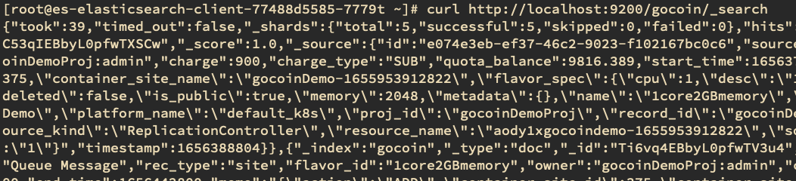

- {{renderer :tocgen}}
- # 概念對照
	- 
- # Search
- **Index**
	- `curl http://localhost:9200/_cat/indices/?v`
	- 加上 `?v` 可以列出欄位
	- 
	- 可以用正規表示式搜尋`GET /_cat/indices/kibana*?v`
	- 可以加上排序 `GET /_cat/indices?v&s=docs.count:desc`
	- 查詢每個 index 所消耗的 memory 為多少，搭配排序
	  `GET /_cat/indices?v&h=i,tm&s=tm:desc`
	-
- **Document**
	- `curl http://localhost:9200/<index>/_search`
	- 
	-
	-