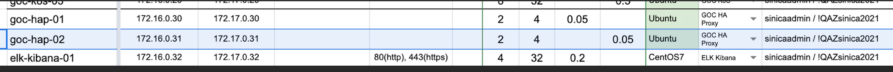

- {{renderer :tocgen}}
- # Description
	- 這個網址可以讓你看到有啟用 script 的 PP 
	  http://jarvis.gemini.local:31964/
# k8s-pool
10.15.99.1~3
gemini/password
- # [[Paas]]
# File Server
	- 打開 mac 裡面的 finder，快捷鍵 `cmd + k` 或是 `前往 > 連接伺服器`
	- 輸入 `afp://172.16.200.50`，並按下連線
	- 卷宗選擇 Gemini_fileserver，xportal release 的位置為 XPORTAL 資料夾
- # SMTP
	- ```javascript
	  { 
	    host: 'smtp.gmail.com',
	    port: 465,
	    secure: true,
	    sendFromAddr: 'contact window <tmp@geminiopencloud.com>'
	    auth:
	    { 
	      user: 'support@geminiopencloud.com',
	  	pass: 'iltwagemini%$#@' 
	    }
	  }
	  ```
- # [[LDAP]]
- # Project
  collapsed:: true
	- ## [GMN](https://gitlab.com/geminiopencloud/product-management2/2.-requirements/ai-console-2021-requirements/-/issues)
		- 產品主線
	- ## Demo GMN
		- 給外部人員試用的 Demo 網站，會有兩個問題要解決(皆已解決)
		- Mapping 內部 IP 到 外部 IP
		- 在 XPortal 中設定 GA(Google Analytics)
			- 參考資料
				- https://ithelp.ithome.com.tw/articles/10192954
				- https://medium.com/geekculture/how-to-use-google-analytics-on-reactjs-in-5-minutes-7f6b43017ba9
				- https://wendeehsu.medium.com/google-analytics-in-react-js-c1b78dc1bbda
	- ## [逢甲](https://gitlab.com/geminiopencloud/professional-services/fcu/-/issues)
		- Branch: FCU
		- helm
			- 目前版本號：v1.7.0-fcu
		- MR
			- [https://gitlab.com/geminiopencloud/engineering/portal/xportal/-/merge\_requests/689/diffs?resolved\_conflicts=true](https://gitlab.com/geminiopencloud/engineering/portal/xportal/-/merge_requests/689/diffs?resolved_conflicts=true)
		- 更新 1.7.0 至 逢甲 branch
	- ## 桂華
	  id:: 71f6fb1f-791e-4efd-a046-06818505f060
		- 環境：
		  https://gitlab.com/geminiopencloud/engineering/portal/xportal/-/wikis/environment/%E6%A1%82%E8%8F%AF-GuiHua-%E7%92%B0%E5%A2%83%E8%B3%87%E8%A8%8A
		  
		  https://gitlab.com/geminiopencloud/engineering/portal/xportal/-/issues/297
		  
		  [異地備援排程功能](https://gitlab.com/geminiopencloud/engineering/portal/xportal/-/issues/462)
		- **狀況**
		  Branch 是 GuiHua2
		  Nodejs version: v10.14.2
		  版本號會是像 0.1.4 這樣，可以在 xportal 的 gitlab tags 中找到  
		  
		  桂華目前沒有PP，收到需求後手動開卡
		  桂華沒有專屬的 installer，它是拿 1.0.53 的 GMN 去裝好後，再各自上 patch 更新成它要的樣子。所以 xportal 這邊的 tag 沒有和 paas 統一。
		- **Merry 交接事項**
		  交接的東西放在以下的 google driver 裡
		  https://drive.google.com/drive/folders/1vAf1OXAaQh7iOz6cAeR-ohZ57iE0F2ZK
		  
		  幾點問題：
			- 目前狀況？
				- 都更新完了？只差測試？
			- 大溪營區 - paas code 備份的作用？
			  	好像有點印象要改什麼
			- 教育訓練的連結是放在誰的目錄下啊？
	- ## 中科院案 (Ncsist)
		- 連線資訊
		  https://gitlab.com/geminiopencloud/professional-services/ncsist/-/wikis/home
		- VPN: Gemini@227!IG0
		- Connect internet
		  	route delete default
		  	route add default -interface en0
		  	route add 10.173.0.0/16 -interface ppp0
		- Jump Node
		  	ssh gemini@10.173.46.6 : gemini
		- SSH tunnel
		  `ssh -NfL 32666:192.168.6.31:32666 gemini@10.173.43.6`
		- frontend config 這樣設定可從前端連 ncsist 後端
		  ```js
		  export const API_GW_ADMIN = 'http://apigw-proxy'; // API_GW_ADMIN_HOST || 'http://10.113.99.1';
		  export const API_GW_PROXY = 'http://apigw-proxy'; // API_GW_PROXY_HOST || 'http://10.113.99.1';
		  export const KONG_ADMIN_PORT = API_GW_ADMIN_PORT || 31218;
		  export const KONG_PROXY_PORT = 8000; // API_GW_PROXY_PORT || 31215;
		  export const NODE_BACKEND = 'http://localhost'; // BASE_URL || 'http://localhost';
		  export const NODE_BACKEND_PORT = 32666; // window.location.port || (window.location.protocol === 'https:' ? 443 : 80);
		  ```
		- ITRI - novaclient ftmode api 說明
		  https://hackmd.io/@4jocGoC0SRi106skGiCKfw/B1ZGt1fWF
		- PAAS - FT API
		  https://hackmd.io/p0pi0496Rv-h4RzOpcP0GA?view
		- codeBase base on 1.7.0_gmn
	- ## 北榮
		- 北榮比較新，所以當時有訂好 v1.5.x 就是給它用 (北榮有 installer，所以 v1.5.0 不只 xportal 在用，paas 也是)
		- 後來 merry 有修正一些問題，所以 xportal 這邊更新成為 v1.5.1，但其它人不動，也不需要重 build installer。
		- 所以 xportal v1.5.1 需要獨自 patch 上去。若下次再有更動，且包含 paas 與 xportal，則下一版 paas & xportal 就都要 tag 成 1.5.2
	- ## TWS (Admin portal)
		- code base：[https://gitlab.com/geminiopencloud/engineering/portal/xportal/-/tree/ADMIN\_PORTAL\_TWS](https://gitlab.com/geminiopencloud/engineering/portal/xportal/-/tree/ADMIN_PORTAL_TWS)
		-
		- 可參考我寫的 wiki 來暸解環境及如何開發
		  [https://gitlab.com/geminiopencloud/engineering/portal/xportal/-/wikis/\[TWS\]-admin-portal-環境及開發資訊](https://gitlab.com/geminiopencloud/engineering/portal/xportal/-/wikis/%5BTWS%5D-admin-portal-%E7%92%B0%E5%A2%83%E5%8F%8A%E9%96%8B%E7%99%BC%E8%B3%87%E8%A8%8A)
		-
		- 這個 branch 在 build image 時只會 build 一個 image (backend)，之前的做法是在要 build image (tag) 前，都會去修改 gitlab-ci.yml 的 VERSION 數字，可以參考最後一次的 commit。然後將 image 直接 cp 到環境中，將 image load 進去後就直接砍 pod 更新 (沒在用 helm package)
		-
		- 我進去 prod 的環境測試時，其實是有 helm 的，我們的安裝也是透過 helm，因此如果要升級的話，其實可以下 `helm upgrade` 的指令
-
	- ## Ncloud
		- Ncloud 的 branch 就是 EDU
		- 包版用 tag 來作， tag 的規則是日期
	- ## 中研院 (SINICA)
		- 要安裝 haproxy & rabbitmq，準備一下筆記跟文件交接給 infra
		    haproxy 是 VM version；rabbitmq 是 container version
		- 安裝 ldap
			- 自動化 ldap
			- https://hub.kubeapps.com/charts/funkypenguin/openldap
			  
			  SINICA 環境資訊
			  https://docs.google.com/spreadsheets/d/1IF5UNiYnINMFKHaf9hYgueIM8V0eZYRkkDaR-jt5z1s/edit#gid=201912917
			  https://docs.google.com/spreadsheets/d/1TPxm0BY7dWucmIGtkG6gHauf6PTdypXX/edit#gid=2003053007
			-
			- 
			- haproxy
				- 172.16.0.30/31 主網 ip
				  172.17.0.30/31 副網 ip (無法對外)
				  172.16.0.202
	- ## ITRI-matlab
		- https://gitlab.com/geminiopencloud/engineering/portal/matlab-report/-/issues/1
-
- # 版號流程
	- https://gitlab.com/geminiopencloud/product-management2/2.-requirements/ai-console-2021-requirements/-/issues/104
	-
	- https://hackmd.io/U8DbPfhQR_6qLVqRNtHGIg?view