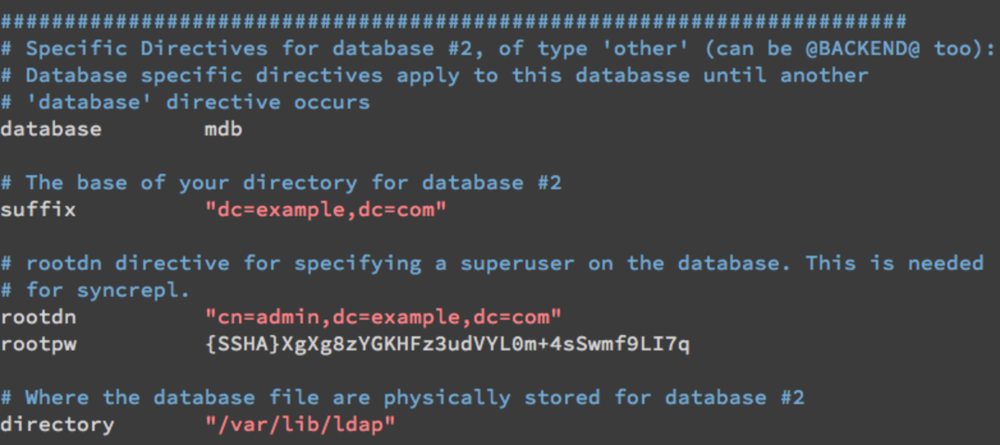
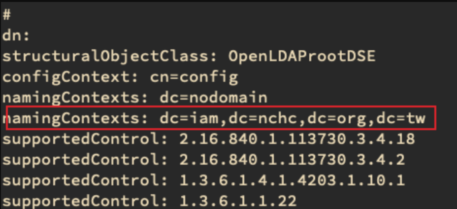
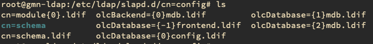
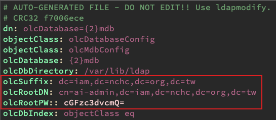
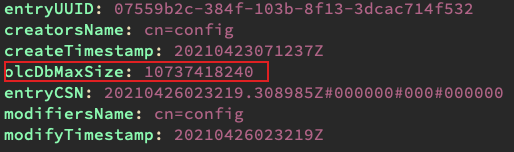

- {{renderer :tocgen}}
- # 基本操作 Basic
  collapsed:: true
	- ## 搜尋
	  collapsed:: true
		- Host ip 要改成LDAP Server domain/IP
		- ```
		  $ ldapsearch -xD cn=admin,dc=nchc,dc=com -w admin -b dc=nchc,dc=com -H ldap://ldap-0-service
		  ```
		- 在本機查詢，可省略 -H 參數
		- **找 Root ( namingContexts )**
		- ```
		  $ ldapsearch -x -LLL -b "" -s base + 
		  ```
	- ## 新增
		- ```
		  ldapadd -x -D cn=admin,dc=nchc,dc=com -w admin -f /container/service/slapd/assets/test/user2.ldif -H ldap://ldap-0-service 
		  
		  # 檔案內容
		  # 密碼直接打明碼即可
		  # 雖然沒經過確認，不過 userPassword 後面是接兩個：的話，密碼要打 Hash 過的亂碼
		  dn: cn=admin,ou=users,dc=ai,dc=nchc,dc=org,dc=tw
		  objectClass: person
		  objectClass: posixAccount
		  sn: ai
		  uidNumber: 11909
		  userPassword: yLJA2jmh
		  uid: admin
		  loginShell: /bin/bash
		  gidNumber: 16528
		  cn: admin
		  homeDirectory: /home/admin
		  ```
	- ## 更新
	  collapsed:: true
		- ```
		  $ ldapmodify -xD cn=config -W -f xxx.ldif
		  ```
		  
		  **更動 dn**
		  
		  ```
		  dn: cn=u2636502,ou=users,ou=ai,ou=unix,dc=iam,dc=nchc,dc=org,dc=tw
		  changetype: moddn
		  newrdn: cn=u2636502
		  deleteoldrdn: 1
		  newsuperior: ou=people,ou=ai,ou=unix,dc=iam,dc=nchc,dc=org,dc=tw
		  
		  # 這樣這筆資料就會從 ou=users 變到 ou=people 底下
		  # 如果要變動 cn 的話，就是更改 newrdn 的值，如 uid=xxx
		  ```
	- ## 刪除
	  collapsed:: true
		- ```
		  ldapdelete -xD cn=admin,dc=nchc,dc=com -w admin  uid=yee,dc=nchc,dc=com  -H ldap://ldap-0-service
		  ```
		- **刪除整顆樹**
		  
		  ```
		  $ ldapdelete -xrvD "cn=admin,dc=split,dc=com,dc=tw" -W "dc=split,dc=com,dc=tw"
		  ```
		- **刪除 namingContexts**
		  ```
		  # 先刪除整顆樹，再停止 ldap
		  $ service slapd stop
		  
		  # 刪除 namingContext 的 mdb.ldif 檔
		  $ mv olcDatabase={2}.mdb.ldif
		  
		  $ service slapd start
		  
		  # 適用於沒有同步，且為最後一個 mdb
		  # 好像還是會有點問題，建議用之前再測試一下
		  ```
	- ## Config 操作
	  collapsed:: true
		- **重新生成 Config**
		  
		  ```
		  $ rm -rf /etc/ldap/slapd.d/*
		  
		  $ slaptest -f /etc/ldap/slapd.conf -F /etc/ldap/slapd.d/
		  # 會出現 rootdn is always granted unlimited privileges. 的警告，無須理會
		  # 有 config file testing succeeded 即是成功，並確認 slapd.d 裡面有生成資料即可。
		  
		  $ chown -R openldap:openldap /etc/ldap/*
		  
		  $ service slapd start
		  ```
		- **dump ldap setting**
		  ```
		  $ slapcat -b cn=config
		  ```
		- **ldap test，檢查設定有沒有問題**
		  ```
		  $ slaptest -d -1 -u -F ./slapd.d/
		  -d: log level
		  -u: dry run
		  -F: config dir 位置
		  -f: slapd.conf 位置
		  ```
	- ## 備份
	  collapsed:: true
		- ```
		  # 備份Config
		  $ slapcat -n 0 -l config.ldif
		  
		  # 備份Data
		  $ slapcat -n 1 -l data.ldif
		  
		  # 先停掉回復，並把設定都刪掉
		  $ service slapd stop
		  $ rm -rf /etc/ldap/slapd.d/*
		  
		  # 回復 Config
		  $ slapadd -n 0 -F /etc/ldap/slapd.d -l /home/ubuntu/ldap-backup/config.ldif
		  
		  # 回復 Data
		  $ slapadd -n 1 -F /etc/ldap/slapd.d -l /home/ubuntu/ldap-backup/data.ldif
		  
		  # 注意權限
		  $ chown -R openldap:openldap /etc/ldap/slapd.d
		  
		  # 如果有做 replication，多加 -w
		  $ slapadd -n 1 -F /config/directory/slapd.d -l /backups/data.ldif -w
		  ```
	- ## Disable user
	  collapsed:: true
		- 使用這個 objectClass pwdAccountLockedTime  
		    [http://www.openldap.org/software/man.cgi?query=slapo-ppolicy&sektion=5&apropos=0&manpath=OpenLDAP+2.3-Release#pwdAccountLockedTime](http://www.openldap.org/software/man.cgi?query=slapo-ppolicy&sektion=5&apropos=0&manpath=OpenLDAP+2.3-Release#pwdAccountLockedTime)
	- ## 找出 Entry 的建立時間
	  collapsed:: true
		- ```
		  # 建立時間單單用 ldapsearch 是不會顯示出來的
		  # ldapsearch 可以指定輸出欄位，可以強迫搜尋結果輸出時間
		  
		  $ ldapsearch -xD cn=ai-admin,dc=iam,dc=nchc,dc=org,dc=tw -W -b dc=iam,dc=nchc,dc=org,dc=tw '(cn=ckliang0521)' createtimestamp
		  
		  # 除了 createtimestamp 外，還有 modifytimestamp
		  # 用 replication 同步過來的 Entry，建立時間還是原本的時間，不是同步的時間，因此要看 modifytimestamp
		  ```
- # 新增 DIT
  collapsed:: true
	- OpenLDAP 支援建立多個 RootDN
	- ## 方法一 slapd.conf
		- 這個方法適用於 slapd.conf 來做初始化 LDAP 的時候  
		    在原本的 slapd.conf 下再新增 database  
		   
		    
		    新增完後再執行
		    
		    ```
		    $ service slapd stop
		    $ slaptest -f slapd.conf  -F slapd.d/
		    $ chown -R openldap:openldap slapd.d/
		    $ service slapd start
		    
		    # 測試
		    $ ldapsearch -xb '' -s base +
		    ```
		    
		    加進第二個 DIT 的時候，可以直接用 slaptest 而不用砍掉 slapd.d/ 資料夾  
		    建立 DIT 之後，記得建立一個 RootDN
		    
		    ```
		    # e.q. rootDN.ldif
		    
		    # iam.nchc.org.tw
		    dn: dc=iam,dc=nchc,dc=org,dc=tw
		    objectClass: top
		    objectClass: dcObject
		    objectClass: organization
		    o: NCHC ORG.
		    dc: iam
		    
		    # admin, iam.nchc.org.tw
		    dn: cn=admin,dc=iam,dc=nchc,dc=org,dc=tw
		    objectClass: simpleSecurityObject
		    objectClass: organizationalRole
		    cn: admin
		    description: LDAP administrator
		    userPassword:: e1NTSEF9ekN2ZnFMOG1MUzJwRTBSdExhYkxzM3lNTWpjMWxybjY=
		    ```
		    
		    執行 `ldapadd -xD cn=admin,dc=xxx,dc=xxx -W -f rootDN.ldif`
	- ## 方式二 ldif
		- 我們也可以利用 ldif 檔來建立 database
		    
		    ```
		    # mdb.ldif
		    dn: olcDatabase=mdb,cn=config
		    objectClass: olcDatabaseConfig
		    objectClass: olcMdbConfig
		    olcDatabase: mdb
		    olcDbDirectory: /var/lib/ldap2
		    olcSuffix: dc=example,dc=com
		    olcRootDN: cn=admin,dc=example,dc=com
		    olcRootPW: password
		    olcDbIndex: objectClass eq
		    ```
		    
		    執行 `ldapadd -xD cn=config -W -f mdb.ldif`  
		    有幾點要注意
		- `olcDbDirectory` 似乎不能跟前一個 DIT 重複
		- 記得先改變 `olcDbDirectory` 的權限設定，  
		    `chown openldap:openldap /var/lib/ldap`
		  
		      建立完後同樣要記得建立 RootDN，方法同上
	- ## 注意事項
		- 如果現在有 LDAP A 及 LDAP B，LDAP A 有作 replication，不知道為何 LDAP B 不會自動同步新建的 LDAP DIT，需要手動再建立一次
		- 建立方式參考上述
		- 建立後記得加上 syncrepl replication
		  ((2634bde0-f6e2-406c-aa30-dbf34a3df7d1))
- # 設定 Log 檔的方式
  collapsed:: true
	- Openldap 預設會透過 rsyslog 的 local4 記錄所有的訊息
	- **Add 30-ldap.conf in /etc/rsyslog.d**
	  
	  ```
	  # LDAP logs
	  local4.* -/var/log/ldap/ldap.log
	  
	  # Uncomment the following to stop logging anything that matches the last rule.
	  # Doing this will stop logging kernel generated UFW log messages to the file
	  # normally containing kern.* messages (eg, /var/log/kern.log)
	  & ~
	  ```
	- **Add ldap in /etc/logrotate.d/**
	  
	  ```
	  # 保留 24 個月記錄，舊記錄自動壓縮，保留上個月不壓縮
	  # 每個月或每 500M 執行一次，檔名以日期標示
	  
	  /var/log/ldap/ldap.log
	  {
	        rotate 24
	        monthly
	        size 500M
	        missingok
	        notifempty
	        compress
	        dateext
	        delaycompress
	        sharedscripts
	        postrotate
	                reload rsyslog >/dev/null 2>&1 || true
	        endscript
	  }
	  ```
	- **Restart**
	  
	  ```
	  systemctl restart rsyslog
	  reload rsyslog
	  ```
	- ## Log Content
	  log 裡面會看到很多類似 `slapd[903]: conn=1021 op=0 BIND dn="" method=128` 的內容
	  method 128 指的是用 simple 來認證，method 163 指的是用 SASL 來認證
- # Install
	- 先往上搜尋 設定 Log，設定完後再往下走
	- ## Ubuntu VM
		- 如果安裝環境有網路的話
		  	```
		  	$ sudo apt update 
		  	$ sudo apt upgrade -y
		  	$ sudo vim /etc/hosts
		  	# 加入 host name 在裡面
		  
		  	$ sudo apt install slapd ldap-utils -y
		  	$ sudo dpkg-reconfigure slapd
		   omit OpenLDAP server configuration? > No
		   DNS domain name > nchc.com
		   Organization name > NCHC
		   Admin Password > password
		   Comfirm Password > password
		   Database backend to use > MDB
		   Remove database when purged > No
		   Move old databases > Yes
		   Allow LDAPv2 protocol > No
		  	```
		- 如果安裝環境**沒有**網路的話
		    你可以在  [google dirver](https://drive.google.com/drive/folders/16RXFNfF5fSPuc67UvyPLM9Aszht-0i_V)  or   [gemini gitlab](https://gitlab.com/geminiopencloud/engineering/gateway/api_gateway/-/tree/develop/deployment/ansible) 找到離線安裝檔  
		    **安裝方式**
		    ```bash
		    # 先安裝 dependencies 資料夾裡的 *.deb 檔
		    $ dpkg -i dependencies/*.deb
		    # 再安裝 slapd & ldap-utils
		    $ dpkg -i *.deb
		    ```
		  
		  安裝好之後，你應該可以看到下列畫面  
		  ```bash
		  $ system status slapd
		  ● slapd.service - LSB: OpenLDAP standalone server (Lightweight Directory Access Protocol)
		   Loaded: loaded (/etc/init.d/slapd; bad; vendor preset: enabled)
		   Active: active (running) since Thu 2021-04-22 05:51:11 UTC; 29s ago
		     Docs: man:systemd-sysv-generator(8)
		  ```
		-
	- ## Docker
	  collapsed:: true
		- 使用時，請接成一行指令
		  ```command
		   docker run -p 389:389 -p 636:636 --name myldap
		   --env LDAP_DOMAIN="ai.nchc.org.tw"
		   --env LDAP_CONFIG_PASSWORD="password"
		   --env LDAP_TLS_VERIFY_CLIENT=try
		   --hostname gemini.com 
		   --env LDAP_DOMAIN="gemini.com"
		   --env LDAP_ORGANISATION="Gemini" 
		   --env LDAP_ADMIN_PASSWORD="password"
		   --detach osixia/openldap:1.3.0
		  ```
	- ## helm
		- 之前寫的有關 kubnetes 安裝 ldap 的 yaml 全都不能用了，安裝不起來，在網路上找了一個 helm 的 chart  還能用，加減用
		  安裝的時候注意 namespace 及 service 需要 nodePort
		  https://hub.kubeapps.com/charts/funkypenguin/openldap
		  https://github.com/helm/charts/tree/master/stable/openldap
# Configuration
collapsed:: true
	- ## 確認 Config 帳號
		- Command `$ ldapsearch -xD '' -s base +`
		    你應該可以看到類似下圖的資訊
		    ```bash
		    # extended LDIF
		    #
		    # LDAPv3
		    # base <> with scope baseObject
		    # filter: (objectclass=*)
		    # requesting: +
		    #
		    dn:
		    structuralObjectClass: OpenLDAProotDSE
		    configContext: cn=config
		    namingContexts: dc=nodomain
		    supportedControl: 2.16.840.1.113730.3.4.18
		    supportedControl: 2.16.840.1.113730.3.4.2
		    ...
		    ```
		    configContext 代表的是你 config 的 root，有關 config 的更動，基本上都會在這個 root 底下。
	- ## 設定 cn=config 的帳密
		- 1. **Command: `$ slappasswd`**  
		        輸入你想要的密碼後記下回傳的字串
		- 2. **Edit olcDatabase={0}config.ldif**  
		        視作業系統 or 安裝版本的不同，LDAP 的路徑會有些微的不同，不過一般來說都會在 `/etc/ldap` 或 `/etc/openldap` 下   
		        
		        編輯 LDAP 路徑下的檔案 `$ vim /etc/ldap/slapd.d/cn=config/olcDatabase={0}config.ldif`  
		        
		        在裡面加上剛剛回傳的密碼  
		        
		- 3. **Restart slapd**  
		        Command: `$ systemctl restart slapd`
		- 4. **Test**  
		        Command: `$ ldapsearch -xD cn=config -W -b cn=config`  
		  
		        `-xD` 後面接的不一定是 `cn=config`，有可能是 `cn=admin,cn=config`  
		        Kubernetes 安裝的版本應該都是 `cn=admin,cn=config`  
		        如果你的帳號是 `cn=admin,cn=config` 的話，代表你的 config 帳號就是這個，之後相關的 config 操作，你都應該使用這個帳號進行  
		        
		        成功的話，你應該會看到類似下圖的畫面  
		        
	- ## 其它 Config
		- 你可以在 [google driver](https://drive.google.com/drive/folders/16RXFNfF5fSPuc67UvyPLM9Aszht-0i_V) or [gemini gitlab](https://gitlab.com/geminiopencloud/engineering/gateway/api_gateway/-/tree/develop/deployment/ldap_template/k8s-template/ldif) 找到我預先寫好的 Config 範例檔，基本上是套用就可以，少數需要改動。
		  
		  Config 範例裡會有兩個資料夾 Config、Data，說明如下：
		- **Config**
			- dit.ldif：新增 Database
			- dbMaxSize.ldif：增加 Database 大小
			- index.ldif：新增 index
			- loglevel：修改 Log Level
			- memberOf：增強 group search
			- refint.ldif：增強 group searh
			- replication.ldif：replication 設定
			- security.ldif：access 設定
		- **Data**
			- ai-data-structure.ldif： ai 的 ldap 資料結構
			- iam-data-structure.ldif： iam 的 ldap 資料結構
		- **使用方式**  
		    ```
		    $ ldapmodify -xD cn=admin,cn=config -W -f xxx.ldif
		    ```
		    ```
		    $ ldapadd -xD cn=xxx,dc=xxx,dc=xxx -W -f xxx.ldif
		    ```
	- ## 建立 DIT
		- 以 Mysql 來比喻的話，DIT 就像是 Mysql 中的 Database 一樣。
		  
		  ```
		  dn: olcDatabase=mdb,cn=config
		  objectClass: olcDatabaseConfig
		  objectClass: olcMdbConfig
		  olcDatabase: mdb
		  olcDbDirectory: /var/lib/ldap/ldpa2
		  olcSuffix: dc=iam,dc=nchc,dc=org,dc=tw
		  olcRootDN: cn=ai-admin,dc=iam,dc=nchc,dc=org,dc=tw
		  olcRootPW: password
		  olcDbIndex: objectClass eq
		  ```
		  ```bash
		  $ ldapadd -xD cn=config -W -f dit.ldif
		  ```
		  
		  olcRootDN 跟 olcRootPW 就是這個 DIT 底下的最高權限管理帳密  
		  
		  要注意的地方是 olcDbDirectory，這是 LDAP 在放 DB 的位置  
		  如果你不想放在 /var/lib/ldap 底下的話，你必須額外執行一些步驟
		- **Edit apparmor**
			- ```bash
			    $ vim /etc/apparmor.d/usr.sbin.slapd
			    # content
			    /var/lib/ldap/ r,
			    /var/lib/ldap/** rwk,
			    # append your ldap db directory
			    /your/path/ r,
			    /your/path/** rwk,
			    
			    $ systemctl restart apparmor
			    ```
		- **chown LDAP db Directory**
			- ```bash
			    # 觀察一下 /var/lib/ldap 的權限及 Owner，把你的 directory 改成一樣的 Owner
			    $ chown openldap:openldap /your/path
			    ```
		- 建立好後，你下 `$ ldapsearch -xb '' -s base +` 應該要可以看到你建立的 DIT
		- 
	- ## 增加 Database 大小
		- ```ldif
		  # dbMaxSize.ldif
		  dn: olcDatabase={1}mdb,cn=config
		  changetype: modify
		  replace: olcDbMaxSize
		  olcDbMaxSize: 10737418240
		  
		  dn: olcDatabase={2}mdb,cn=config
		  changetype: modify
		  replace: olcDbMaxSize
		  olcDbMaxSize: 10737418240
		  ```
		  ```bash
		  $ ldapmodify -xD cn=config -W -f dbMaxSize.ldif
		  ```
		- 這份範例更動了兩個 DIT 的 Db size，要如何確定你要更動哪個 DIT 呢？
		- 到你的 LDAP 資料夾底下的這個位置 `/etc/ldap/slapd.d/cn=config`，你必須要確定你的 DIT 是第幾個 DIT，列出檔名如下
		- 
		- 並一一的檢視 olcDatabase={x}.mdb.ldif 中的 olcSuffix 是不是你要的 DIT 的名稱。   
		  如果是，那麼 dn + `,cn=config` 就是你要更動 DIT 的 dn
		- 
		- olcDbMaxSize 的單位是 byte，用 1024 下去計算，所以範例是 10 GB
		- 你可以在剛剛檢視的 olcDatabase={x}.mdb.ldif 檔案確認有沒有更改成功
		- 
	- ## Data Structure
		- 這兩個都是 For 國網設計的 LDAP 結構，看情況使用
		  
		  如果要建的話，你應該使用該 DIT 底下的最高權限者建立
		  For example:
		  ```bash
		  $ ldapadd -xD cn=ai-admin,dc=iam,dc=nchc,dc=org,dc=tw -W -f iam-data-structure.ldif
		  ```
# Replication
collapsed:: true
	- ## 同步設定
		- 同步的設定在 olcSyncrepl，如果是沒有設定過的，這項應該會是空白找不到  
		    我們一般來說都會用模版來設定，文件後會附完整模版，copy 後存成 .ldif 檔並執行
	- ## 設定 Server ID
		- ```yaml
		  dn: cn=config
		  changetype: modify
		  replace: olcServerID
		  olcServerID: 1 ldap://[host name or host IP]
		  olcServerID: 2 ldap://[host name or host IP]
		  ```
	- ## 開啟同步模組
		- `olcDatabase` 這裡要填剛剛 cn=config 找到的 dn
		  ```ldif
		  	# Add Syncprov on backend
		  	dn: cn=module{0},cn=config
		  	changetype: modify
		  	add: olcModuleLoad
		  	olcModuleLoad: syncprov
		  
		  	dn: olcOverlay=syncprov,olcDatabase={1}mdb,cn=config
		  	changetype: add
		  	objectClass: olcOverlayConfig
		  	objectClass: olcSyncProvConfig
		  	olcOverlay: syncprov
		  	```
		- 執行：  `ldapmodify -xD [cn=admin,]cn=config -W -f module.ldif`
	- ## 設定 config 同步
		- 這個是用來設定兩個 ldap host 之間的 config 同步
		  
		  ```ldif
		  dn: olcDatabase={0}config,cn=config
		  changetype: modify
		  replace: olcSyncRepl
		  olcSyncRepl: rid=003 provider=ldap://ldap-0-service binddn="cn=admin,cn=config" bindmethod=simple
		  credentials="password" searchbase="cn=config" type=refreshAndPersist
		  retry="10 5 60 +" timeout=1
		  olcSyncRepl: rid=004 provider=ldap://ldap-1-service binddn="cn=admin,cn=config" bindmethod=simple
		  credentials="password" searchbase="cn=config" type=refreshAndPersist
		  retry="10 5 60 +" timeout=1
		  ```
	- ## 設定 olcSyncRepl
		- 注意 `provider`，這裡如果是 vm 的話，一般來說都是 hostname
		- 確認的方法就是拿這個下去做 ldapsearch，打的通就可以用  
		  `ldapsearch -xD cn=config, -W -b cn=config -H ldap://ldap-0-service:389`
		- 這裡設定了三個 olcSyncRepl，一個用來跟國網做同步，另外兩個是 host 之間的同步
		- 第一個 rid=001，就是跟國網的同步，基本上不用做更動
		- 第二個 rid=005 (rid 可變更，需要是唯一的數字)，binddn 要用 admin 的帳號，credentials 填密碼，searchbase 填要同步的 path
		- 第三個以第二個類推
		- ```ldif
		  dn: olcDatabase={1}mdb,cn=config
		  changetype: modify
		  replace: olcSyncRepl
		  olcSyncRepl: rid=001 provider=ldap://140.110.8.170 binddn="cn=ai-admin,dc=iam,dc=nchc,dc=org,dc=tw" bindmethod=simple
		  credentials="1qaz2wsx3edc" searchbase="dc=iam,dc=nchc,dc=org,dc=tw" type=refreshOnly 
		  interval=00:00:01:00 retry="10 5 60 +"
		  olcSyncRepl: rid=005 provider=ldap://ldap-0-service binddn="cn=admin,dc=iam,dc=nchc,dc=org,dc=tw" bindmethod=simple
		  credentials="password" searchbase="dc=iam,dc=nchc,dc=org,dc=tw" type=refreshAndPersist
		  retry="10 5 60 +"
		  olcSyncRepl: rid=006 provider=ldap://ldap-1-service binddn="cn=admin,dc=iam,dc=nchc,dc=org,dc=tw" bindmethod=simple
		  credentials="password" searchbase="dc=iam,dc=nchc,dc=org,dc=tw" type=refreshAndPersist
		  retry="10 5 60 +"
		  -
		  add: olcMirrorMode
		  olcMirrorMode: TRUE
		  ```
		- 注意！olcMirrorMode 很重要，如果後面有 `Shadow context; no update referral` 的錯誤，多半都是這個屬性所引起的  
		  在 slapd.conf 的階段注意千萬不要設定 mirrormode on，會導致上述錯誤發生，幾乎無解。
	- ## 執行
		- 把上述內容存成 .ldif 檔並執行  `ldapmodify -xD cn=config -W -f xxx.ldif`
		- 如果出現這樣的錯誤，加入 olcMirrorMode 之後再試一次
		  ```
		  ldap_modify: Server is unwilling to perform (53)
		    additional info: shadow context; no update referral
		  ```
	- ## 檢查
		- 檢查 cn=config 的設定有沒有出來，可以做 ldapsearch 來看國網的 user 有沒有同步過來
	- ## 檔案對照
		- **replication.ldif**
		  
		  ```ldif
		  dn: olcDatabase={0}config,cn=config
		  changetype: modify
		  replace: olcSyncRepl
		  olcSyncRepl: rid=003 provider=ldap://ldap-0-service binddn="cn=admin,cn=config" bindmethod=simple
		  credentials="password" searchbase="cn=config" type=refreshAndPersist
		  retry="10 5 60 +" timeout=1
		  olcSyncRepl: rid=004 provider=ldap://ldap-1-service binddn="cn=admin,cn=config" bindmethod=simple
		  credentials="password" searchbase="cn=config" type=refreshAndPersist
		  retry="10 5 60 +" timeout=1
		  
		  # Add Syncprov on backend
		  dn: olcOverlay=syncprov,olcDatabase={1}mdb,cn=config
		  changetype: add
		  objectClass: olcOverlayConfig
		  objectClass: olcSyncProvConfig
		  olcOverlay: syncprov
		  
		  dn: olcDatabase={1}mdb,cn=config
		  changetype: modify
		  replace: olcSyncRepl
		  olcSyncRepl: rid=001 provider=ldap://140.110.8.170 binddn="cn=ai-admin,dc=iam,dc=nchc,dc=org,dc=tw" bindmethod=simple
		  credentials="1qaz2wsx3edc" searchbase="dc=iam,dc=nchc,dc=org,dc=tw" type=refreshOnly 
		  interval=00:00:01:00 retry="10 5 60 +"
		  olcSyncRepl: rid=005 provider=ldap://ldap-0-service binddn="cn=admin,dc=iam,dc=nchc,dc=org,dc=tw" bindmethod=simple
		  credentials="password" searchbase="dc=iam,dc=nchc,dc=org,dc=tw" type=refreshAndPersist
		  retry="10 5 60 +"
		  olcSyncRepl: rid=006 provider=ldap://ldap-1-service binddn="cn=admin,dc=iam,dc=nchc,dc=org,dc=tw" bindmethod=simple
		  credentials="password" searchbase="dc=iam,dc=nchc,dc=org,dc=tw" type=refreshAndPersist
		  retry="10 5 60 +"
		  -
		  add: olcMirrorMode
		  olcMirrorMode: TRUE
		  
		  # Add Syncprov on backend
		  dn: olcOverlay=syncprov,olcDatabase={2}mdb,cn=config
		  changetype: add
		  objectClass: olcOverlayConfig
		  objectClass: olcSyncProvConfig
		  olcOverlay: syncprov
		  
		  # Add sync replication on backend
		  dn: olcDatabase={2}mdb,cn=config
		  changetype: modify
		  add: olcSyncRepl
		  olcSyncRepl: rid=007 provider=ldap://ldap-0-service binddn="cn=ai-admin,dc=ai,dc=nchc,dc=org,dc=tw" bindmethod=simple
		  credentials="password" searchbase="dc=ai,dc=nchc,dc=org,dc=tw" type=refreshAndPersist
		  retry="10 5 60 +"
		  olcSyncRepl: rid=008 provider=ldap://ldap-1-service binddn="cn=ai-admin,dc=ai,dc=nchc,dc=org,dc=tw" bindmethod=simple
		  credentials="password" searchbase="dc=ai,dc=nchc,dc=org,dc=tw" type=refreshAndPersist
		  retry="10 5 60 +"
		  -
		  add: olcMirrorMode
		  olcMirrorMode: TRUE
		  ```
# Trouble Shooting
	- ## olcDbDirectory: value \#0: invalid path: Permission denied
	  id:: 2634bde0-f6e2-406c-aa30-dbf34a3df7d1
		- 在加入第二個 DIT 的時候出現這個錯誤，看到這個錯誤需注意
		- 1.  olcDbDirectory 的路徑是不是有改權限？  `chown openldap:openldap /your/path`
		- 2.  olcDbDirectory 的所在資料夾是不是需要 root 權限？
		    ```bash
		    $ vim /etc/apparmor.d/usr.sbin.slapd
		    # content
		    /var/lib/ldap/ r,
		    /var/lib/ldap/** rwk,
		    # append
		    /your/path/ r,
		    /your/path/** rwk,
		    
		    $ systemctl restart apparmor
		    ```
		- 之後再 `ldapadd -xD cn=config -W -f dit.ldif` 即可
-
- # [[國網 LDAP 記錄]]
- # 設定 TLS LDAP Certificate
  collapsed:: true
	- 用這個 docker 來進行設定 [docker-openldap](https://github.com/osixia/docker-openldap)
	- 這個指令在 container 內部有用，但是在 container 外面就會連不到。
	  -d 可以列出詳細的訊息，方便 debug
	  ```
	  ldapsearch -xD cn=admin,dc=ai,dc=nchc,dc=org,dc=tw \
	  -w password -b dc=ai,dc=nchc,dc=org,dc=tw \
	  -H ldaps://localhost:636 -d 1
	  ```
	- 錯誤訊息如下：
	  ```
	  TLS: during handshake: peer cert is valid, or was ignored if verification disabled (-9841)
	  TLS: during handshake: Peer certificate is not trusted: kSecTrustResultRecoverableTrustFailure
	  tlsst_session_upflags(0x7fb7a7c040a0)
	  tlsst_session_errmsg(0x7fb7a7c040a0)
	  TLS: can't connect: SSLHandshake() failed: misc. bad certificate (-9825).
	  ```
	  感覺是憑證不受信任的問題。
	- 從 container 內部 call 憑證出來
	  container 內部 ca 的憑證位置在：`/container/service/:ssl-tools/assets/default-ca/`
	  會發現是因為 ldap 的 ca.crt link
	  把三個檔案都 call 出來，但是用 UI 匯不進去 mac 裡
	- 找到了一個網頁教人怎麼用 openssl 匯入
	  [如何使用 OpenSSL 建立開發測試用途的自簽憑證 (Self-Signed Certificate)](https://blog.miniasp.com/post/2019/02/25/Creating-Self-signed-Certificate-using-OpenSSL)
	- 下指令
		- `sudo security add-trusted-cert -d -r trustRoot -k /Library/Keychains/System.keychain default-ca.pem`
		- 因為是憑證，所以我猜應該是 default-ca.pem 而不是 default-ca-key.pem
	- 下完後重新在 container 之外執行 ldapsearch，錯誤訊息改變了
	  ```
	  TLS: during handshake: peer cert is valid, or was ignored if verification disabled (-9841)
	  TLS: during handshake: Peer certificate is trusted
	  tlsst_socket_write(0x7fda4ce0b608, 12)
	  tlsst_socket_write(0x7fda4ce14328, 75)
	  tlsst_socket_write(0x7fda4ce0bdd8, 6)
	  tlsst_socket_write(0x7fda4ce0b6f8, 45)
	  tlsst_socket_read(0x7fda4d00ea00, 5)
	  TLS: during handshake: connection closed via error (-9806)
	  ```
	  憑證好像被信任了，但是還是讀不到。
	- 後來看到有人有類似的問題
	  [TLS: can't accept: No certificate was found](https://github.com/osixia/docker-openldap/issues/105)
	- 簡單的來說呢，啟動的指令變成
	  ```
	  docker run -p 389:389 -p 636:636 \
	  --name myldap 
	  --hostname gemini.com 
	  --env LDAP_DOMAIN="ai.nchc.org.tw" 
	  --env LDAP_CONFIG_PASSWORD="password" 
	  --env LDAP_TLS_VERIFY_CLIENT=try 
	  --env LDAP_ORGANISATION="Gemini" 
	  --env LDAP_ADMIN_PASSWORD="password" 
	  --detach osixia/openldap:1.3.0
	  ```
	  加上 hostname 及 env
	- 然後就可以用 hostname 來存取 ldaps 服務
	  ```
	  ldapsearch -xD cn=admin,dc=ai,dc=nchc,dc=org,dc=tw -wpassword -b dc=ai,dc=nchc,dc=org,dc=tw -H ldaps://gemini.com:636
	  ```
	- LDAP_TLS_VERIFY_CLIENT，這個方法並不是很好，關掉了 client 端的驗證。
	  後來發現不用加這個也可以 work
- # 封存記錄
  collapsed:: true
	- 這裡的寫法已經有點過時了，現在的 ldap 並不建議使用 slapd.conf 的做法
	  ```bash
	  $ sudo su
	  $ slappasswd
	  # 輸入密碼後並記下來，後面會用到
	  {SSHA}oL8dVa94g4jkpErhbsXMa9gwVfJoxTp9
	  
	  $ service slapd stop
	  $ cp /usr/share/slapd/slapd.conf /etc/ldap/
	  $ vim /etc/ldap/slapd.conf
	  # 以下只記錄修改的部份
	  - loglevel        none
	  + loglevel        16640
	  
	  - moduleload      back_@BACKEND@
	  + moduleload      back_mdb.la
	  + moduleload      syncprov.la
	  
	  - sizelimit	      500
	  + sizelimit	      unlimited
	  
	  - backend         @BACKEND@
	  + backend         mdb
	  
	  - database        @BACKEND@
	  + database        mdb
	  
	  - suffix          "@SUFFIX@"
	  + suffix          "dc=iam,dc=nchc,dc=org,dc=tw"
	  
	  + rootdn          "cn=admin,dc=nchc,dc=com"
	  + rootpw          {SSHA}oL8dVa94g4jkpErhbsXMa9gwVfJoxTp9
	  ^ 輸入剛剛 slappasswd 的密碼
	  
	  - dbconfig set_cachesize 0 2097152 0
	  + # dbconfig set_cachesize 0 2097152 0
	  
	  - dbconfig set_lk_max_objects 1500
	  + # dbconfig set_lk_max_objects 1500
	  
	  - dbconfig set_lk_max_locks 1500
	  + # dbconfig set_lk_max_locks 1500
	  
	  - dbconfig set_lk_max_lockers 1500
	  + # dbconfig set_lk_max_lockers 1500
	  
	  + index      objectClass,entryCSN,entryUUID eq
	  
	  - access to attrs=userPassword,shadowLastChange
	          by dn="@ADMIN@" write
	          by anonymous auth
	          by self write
	          by * none
	  + access to attrs=userPassword,shadowLastChange
	          by dn="cn=admin,dc=nchc,dc=com" write
	          by anonymous auth
	          by self write
	          by * none
	  
	  - access to *
	          by dn="@ADMIN@" write
	          by * read
	  + access to *
	          by dn="cn=admin,dc=nchc,dc=com" write
	          by * read
	  
	  + index entryCSN,entryUUID eq
	  
	  + overlay syncprov
	  + syncprov-checkpoint 100 10
	  + syncprov-sessionlog 100
	  + serverID      1
	  ## 以下因為使用 multi-replication，所以暫時觀察不用
	  ## + syncrepl      rid=123
	  ##                 provider=ldap://10.113.1.5
	  ##                 bindmethod=simple
	  ##                 binddn="cn=admin,dc=nchc,dc=com"
	  ##                 credentials=password
	  ##                 searchbase="dc=nchc,dc=com"
	  ##                 schemachecking=off
	  ##                 type=refreshAndPersist
	  ##                 retry="60  +"
	  ## + mirrormode on
	  
	  $ rm -rf /etc/ldap/slapd.d/*
	  $ slaptest -f /etc/ldap/slapd.conf -F /etc/ldap/slapd.d/
	  # 會出現 rootdn is always granted unlimited privileges. 的警告，無須理會
	  # 有 config file testing succeeded 即是成功，並確認 slapd.d 裡面有生成資料即可。
	  $ chown -R openldap:openldap /etc/ldap/*
	  $ service slapd start
	  
	  # 以上是 node1 的設定，node2 的設定基本上相同，只是有幾個地方要修改。
	  # slapd.conf 的設定改成
	  serverID     2
	  provider=ldap://10.113.1.18
	  
	  # 在此說明一下，serverID必須是唯一，provider則是設成另一個 node 的IP，provider指的是要去哪裡同步資料。
	  ```
	  **以上的作法 LDAP 並不建議使用**