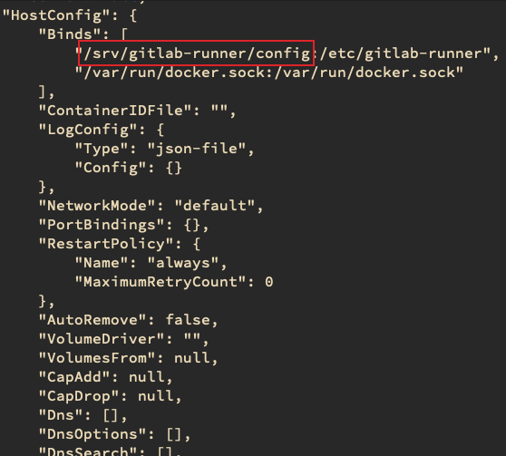

- #Gemini
- {{renderer :tocgen}}
-
- # Task System Refactor
	- 預期使用方式
		- ```javascript
		  const controller = "commonController";
		  const functionName = "callApi";
		  
		  const apiParams = api ? apiCollection[api.type][api.name] : params;
		  self[controller][functionName](apiParams)
		  
		  
		  ```
	- 新的 api payload 長相
	- ```javascript
	  [
	    {
	      actionType: 'GET_SECRET',
	      clientType: 'GOC',
	      polling: true,
	      bundle: true,  // 要整包丟回來
	      retry: { times: 5, interval: 200 }, // 失敗的話重試
	      // controller: "common", // optional, default
	      // function: "callApi", // optional, default
	      auth: { username, projectName },
	      api: { type: 'secret', name: 'GET_SECRET' },
	      params: {
	        currentPlatform,
	        project,
	        name,
	        type,
	        desc,
	      },
	    },
	    {
	      actionType: 'GET_USER_INFO',
	      clientType: 'GOC',
	      polling: false,
	      controller: 'userController',
	      function: 'getUserInfo',
	      auth: { username, projectName },
	      params: {
	      }
	    },
	    [
	      {
	        clientType: 'GOC',
	        apiType: 'GET_SECRET',
	        api: {
	          url: `/api/v3/${currentPlatform}/secrets/`,
	          method: 'post',
	          header: { 'x-api-key': apiKey },
	          auth: { username },
	          data: {
	            project: platforms?.[currentPlatform]?.paasProjId,
	            name: formData.secretName,
	            type: formData.secretType,
	            desc: formData.desc,
	            data,
	          },
	        },
	      },
	    ],
	  ]
	  ```
- # Enviroment
  collapsed:: true
	- ## CI drone
		- **server**
			- gemini@172.16.250.20 / password
		- **Folder**
			- ~/drone
		- **為什麼 gitlab 在 CI drone server 的檔案會傳到 file server **
			- 稍微說明一下，為什麼 .gitlab-ci.yml 裡面可以把 build 好的 image 傳到 fileserver 上
			- 在 .gitlab-ci.yml 上最後一行
			  `cp /$RELEASE_PATH/${BACKEND_IMAGE_NAME}_${SPLIT_TAG}.* /XPORTAL_Release/`
			  會把 build 好的 .tar & .chksum 複製到 /XPORTAL_Release/ 資料夾
			- 在 drone server 上可以看到 docker container gitlab-runner ，gitlab 在跑 CI 的時候，會透過這個 container 再啟一個 container 來執行定義在 .gitlab-ci.yml 的流程
			- 我們下指令來看看它裡面的設定 `docker inspect gitlab-runner`
			  可以看到這個的 Host Config 位置
			- 
			- 我們回到 drone server 上去檢查這個資料夾，發現裡面有一個 config.toml 檔案，打開來看看
			  可以發現其中一個 runner 的設定，有我們要的答案
			  ```
			  [[runners]]
			  name = "goc helm package builder"
			  url = "https://gitlab.com/"
			  token = "_jw1rLo9q7WtoyCVdtns"
			  executor = "docker"
			  [runners.custom_build_dir]
			  [runners.docker]
			    tls_verify = false
			    image = "adgear/helm-chart-resource:latest"
			    privileged = false
			    disable_entrypoint_overwrite = false
			    oom_kill_disable = false
			    disable_cache = false
			    volumes = ["/mnt/APIGW/:/APIGW_Release/", "/home/gemini/drone/apigw/:/apigw", "/cache", "/mnt/XPORTAL/:/XPORTAL_Release/", "/home/gemini/drone/xportal/release/GMN/:/release/GMN/", "/home/gemini/drone/xportal/release/EDU/:/release/EDU/", "/mnt/COMMON/:/COMMON_Release/", "/mnt/GFaas/:/GFaas_Release/", "/home/gemini/drone/gfaas/release/helm/:/gfaas/helm/", "/home/gemini/drone/common/:/common", "/home/gemini/drone/nchc_serverless:/nchc_serverless", "/home/gemini/drone/lunar/:/lunar"]
			    pull_policy = "if-not-present"
			    shm_size = 0
			  [runners.cache]
			    [runners.cache.s3]
			    [runners.cache.gcs]
			  ```
			  gitlab runner 在啟動 container 的時候，會把 /mnt/XPORTAL mount 到 container 中的 /XPORTAL_Release/
			- 我們檢查 drone server 上 mount point，可以發現
			  `//172.16.200.50/Gemini_fileserver /mnt cifs rw,`
			  /mnt 是從 fileserver mount 過來的
			- 至此水落石出，container 中的檔案複製到 /XPORTAL_Release 就等同複製到 drone server 上的 /mnt/XPORTAL/，就等同複製到 fileserver 上的 /XPORTAL
	-
- # Migrations
  collapsed:: true
	- ##  produce migrations
	  1. 在 backend 目錄下執行
	  	`$ node_modules/db-migrate/bin/db-migrate create mariadb-migration --sql-file`
	  2. 編輯 backend/migrations/sqls 產生出來的 `*-up.sql` 檔案
	  3. `$ npm run migrate` 進行測試
	- ## Re migrations
	  要怎麼重新執行 migrate？
	  migration 會記錄在 xportal DB 中的 migrations，執行 migration 的時候會檢查這張 table，不在上面的 migration 就會執行
	  
	  所以只要刪掉該筆記錄再執行 `npm run migrate` 就會執行該筆 migration
	- ## Notes
		- 一般來說，menu_route 的 menu 一開始的 role 都會是 `[]`
		- 在 backend 底下執行 `node job_upgrade.js` 就會自動填入 role，不需要手動一個一個填